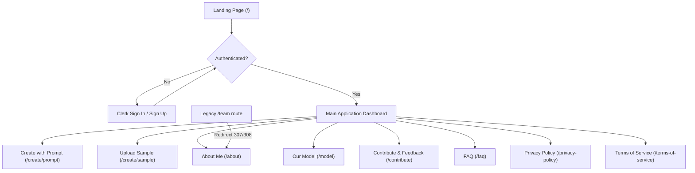
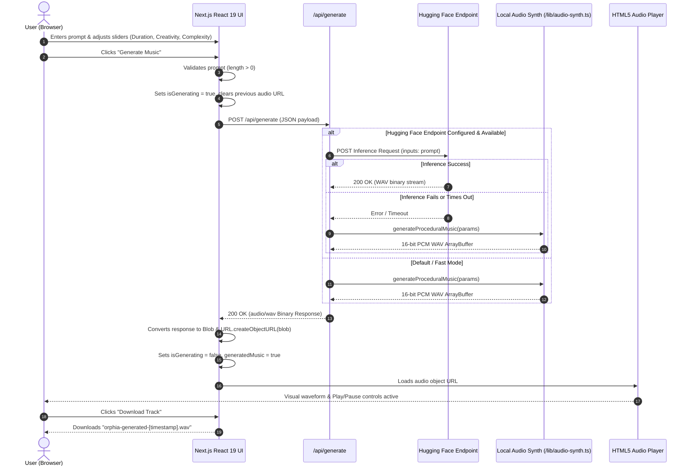
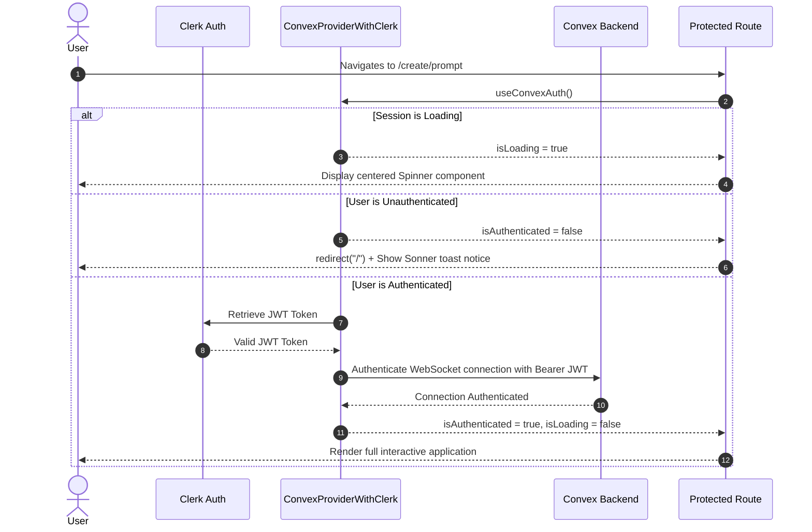
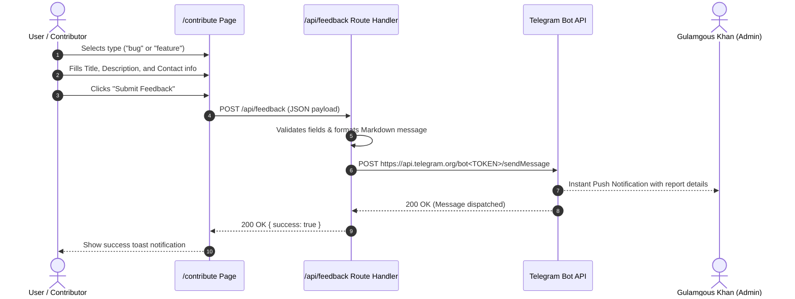

# Application Flow & Architecture Workflows — Orphia

This document details the user journeys, state machines, and system execution sequences across the Orphia web application.

---

## 1. Application Navigation Map

---

## 2. Text-to-Music Generation Flow

The diagram below details the entire generation lifecycle from user input to binary audio playback:

---

## 3. Authentication & Authorization Flow

Orphia integrates **Clerk** for user identity management and **Convex** for real-time backend services:

---

## 4. Real-Time Feedback & Bug Report Pipeline

When users submit bugs or suggestions on `/contribute`, the report is routed instantly to the developer's Telegram account:

---

## 5. UI State Transition Matrix (Generation Page)

| State | `isGenerating` | `generatedMusic` | `audioURL` | UI Elements Visible |
| :--- | :--- | :--- | :--- | :--- |
| **Idle** | `false` | `false` | `""` | Prompt textarea enabled, Sliders enabled, "Generate" button active. |
| **Generating** | `true` | `false` | `""` | Inputs disabled, "Generating..." button with spinner, loader overlay. |
| **Completed** | `false` | `true` | `"blob:..."` | Play/Pause audio controls, progress bar, "Download WAV" button active. |
| **Error** | `false` | `false` | `""` | Sonner error toast displayed, inputs re-enabled for revision. |
