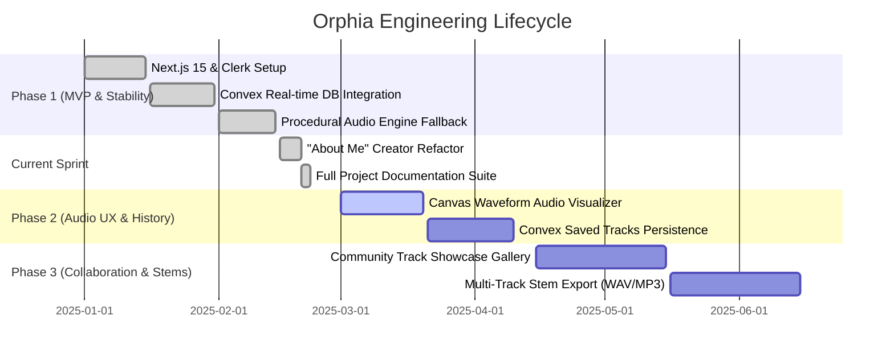

# Implementation Plan & Engineering Roadmap — Orphia

**Project:** Orphia AI Music Generator  
**Lead Engineer:** Gulamgous Khan  
**Current Release:** v0.1.5  

---

## 1. Engineering Roadmap Overview



---

## 2. Phase-by-Phase Breakdown

### Phase 1: Core Foundation & Resilient Audio (Completed)
- [x] **Next.js 15 App Router & React 19 UI:** Built modern responsive interface with Tailwind CSS and Radix UI components.
- [x] **Clerk + Convex Integration:** Configured zero-latency reactive database connected to Clerk identity provider.
- [x] **Zero-Downtime Audio Engine:** Developed in-memory algorithmic synthesis engine (`/lib/audio-synth.ts`) producing 44.1kHz 16-bit PCM WAV files, eliminating external cloud dependency risks.
- [x] **Telegram Webhook Alerting:** Instant push notification pipeline from `/contribute` to Gulamgous Khan's private Telegram bot.

---

### Phase 1.5: Solo Creator Refactor & Complete Docs (Current Release)
- [x] **Refactor "Our Team" to "About Me":**
  - Updated `constants/nav-values.tsx` and `constants/header-values.tsx` to display "About Me" with the `User` icon.
  - Built high-impact creator showcase page at `app/(extra)/about/page.tsx` spotlighting Gulamgous Khan's engineering credentials, skills, and vision.
  - Added clean redirect in `app/(extra)/team/page.tsx` for backwards compatibility.
  - Updated `app/sitemap.ts` for search engine visibility.
- [x] **Comprehensive Documentation Architecture:**
  - Created dedicated `docs/` repository hub housing PRD, TRD, App Flow, Design System, Schema, Tracker Rules, Component Library, and Decisions.

---

### Phase 2: Audio Experience & Track History (Upcoming)
- [ ] **Canvas-Based Waveform Visualizer:**
  - Integrate Web Audio API `AudioContext` and `AnalyserNode` to render animated frequency spectrum bars and oscilloscopes during playback.
- [ ] **Persistent Track History in Convex:**
  - Save prompts, generation timestamps, and audio binary references in Convex storage.
  - Allow users to access their "My Generated Tracks" library with replay and re-download capability.
- [ ] **Prompt Presets & Genre Tags:**
  - Provide one-click inspiration tags ("Lo-Fi Study", "Cyberpunk", "Cinematic Orchestral", "Deep Ambient") for instant prompt composition.

---

### Phase 3: Community & Multi-Track Stems (Future Vision)
- [ ] **Public Showcase Gallery:**
  - Enable users to opt-in to publish their favorite generations to a community explore feed with like and fork capabilities.
- [ ] **Stem Separation & Multi-Track Export:**
  - Separate synthesized compositions into discrete audio stems: Melody, Bass, Harmony, and Drums.
  - Allow independent download of individual stem tracks for music producers importing into Ableton Live, FL Studio, or Logic Pro.

---

## 3. Release Checklist & Verification Steps

Before any deployment to Vercel production:

1. **Static Analysis & Typecheck:**
   ```bash
   npm run lint
   npx tsc --noEmit
   ```
2. **Audio Generation Sanity Check:**
   - Submit prompt with duration = 10s.
   - Verify WAV buffer returns 200 OK within 2 seconds.
   - Verify audio plays seamlessly in Chrome, Safari, and Firefox.
3. **Route Integrity:**
   - Verify `/about` loads without hydration mismatch.
   - Verify `/team` smoothly redirects to `/about`.
4. **Auth Guards:**
   - Confirm unauthenticated sessions redirect cleanly to `/`.
